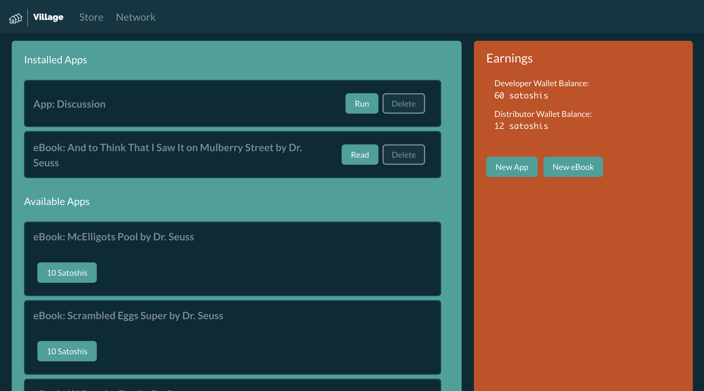

# The Village Protocol: A decentralized app network powered by Bitcoin Lightning

## Try it now: &nbsp;&nbsp;[The Village Protocol](https://suprraz.github.io/village/)

### What is The Village?

Village is a fully decentralized peer-to-peer app store and network living inside a mesh of web browsers. Developers,
distributors and protocol maintainers make Bitcoin for scaling the protocol. After joining
the network and connect to peers, all the content in the web page is served by peers. Servers are not
used except to facilitate the network discovery and enable revenue distribution. This codebase can
be downloaded and run on any computer - it's really just an HTML file.

### How to make money on Village

There are three ways to make money with Village. Payouts are made exclusively in Bitcoin over the Lightning protocol.

1. Become a distributor. Anyone can be an distributor. Distributors help quality apps gain exposure. Simply keeping a
   browser tab open makes all applications that the distributor has purchased available for purchase to others. Each
   time a purchase is made through a distributor, they get a percentage of fees according to
   the [fee structure](#fee-structure).
2. Develop an application. Application developers make money by making applications available for purchase. Each time
   the application is purchased, even if the developer is offline, the developer will get paid according to
   the [fee structure](#fee-structure).
3. Improve the Village Protocol. The protocol has unlimited room for improvement. Protocol developers will be rewarded
   for every sale on the network. The percentage of maintenance fees received will be proposed as part of the change
   request. The merge will be approved or denied by maintainers. Maintainers are those who have had code merged into the
   protocol. Only maintainers can vote on merge approvals as they will be diluting their share of the
   total [maintenance fee](#fee-structure) by allowing the merge.

### How is the Village protocol built and maintained?

Village is an open source project.  The project is built and maintained by proposing code changes.   When an improvement 
is proposed, maintainers decide whether it should be included or rejected. This allows Village to continue improving. 
Have an idea to improve Village? Code it up and submit a change request!

### What tools are required to code Village apps?

You can start coding Village apps today with just simple Javascript. The tpps are bundled as single page HTML apps that
include all assets.

A React.JS single page bundler is [provided here](templates/village-react-app). Simply `npm run build` then publish an
app with the contents of `build/index.html` as the source.

### Where is the Village data stored?

Village data is stored in the web browser's data stores. When new data enters the network, it is shared and replicated
amongst peers as backup.

### Protocol Core Principles

    - Decentralization
    - Merit over status
    - Censorship resistance
    - Freedom of choice

### Fee structure

Income will be distributed amongst contributors to incentivize scalable growth of the network. Earnings from app sales
are distributed as follows:

    - 70% Developer:  The publisher of the application.
    - 10% Distributor: The node the app was purchased from.
    - 20% Village Protocol maintainers: Those that build and maintain this code base.

### Protocol Development

Each pull request will propose a percentage to take from future revenues.The percentage will be
negotiated with past reviewers. PR voting rights will be awarded to past contributors.

### Architecture

The Village Protocol is just an HTML file. Being frontend-only allows for decentralization: the folder can be dropped
on any server or localhost and connect to the network.

The Village Protocol works by creating a mesh of WebRTC peers. Initial connection is facilitated by public MQTT
services. For further decentralization the connection strings can be exchanged via any messaging network or even
manually via copy and paste. After the initial connection, new peers are discovered in P2P fashion over WebRTC.

Apps run in iFrame sandboxes. Apps interface with the Village Protocol via an API.

App paywalls and payout distributions are facilitated by [LNBits](https://github.com/lnbits/lnbits). Once
[Bolt12](https://www.bolt12.org) is ready The Village Protocol payouts can be further decentralized.

### License

The Village Protocol is released under the terms of the MIT license. See https://opensource.org/licenses/MIT.
